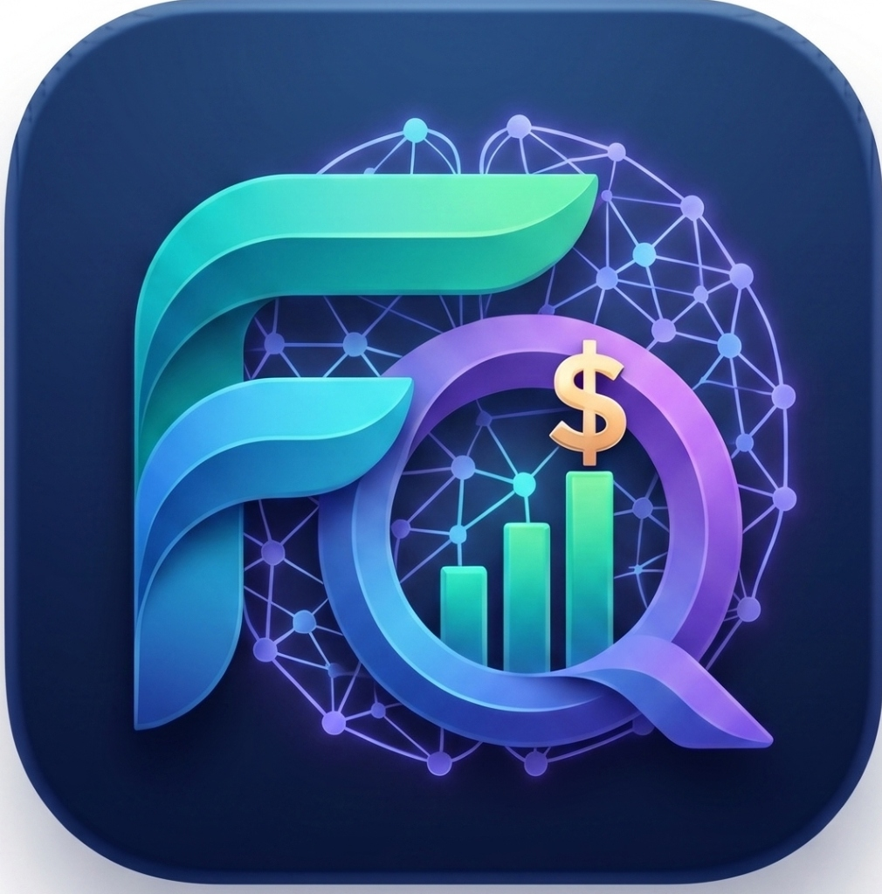

# FynIQ 🌐 
### Outsmart your spending.

FynIQ is a next-generation, Gen-Z inspired expense tracker built with Flutter. It combines cutting-edge glassmorphism aesthetics with powerful local-first data processing to provide a secure, proactive, and visually stunning financial management experience.



---

## ✨ Key Features

### 📊 Intelligent Insights
*   **Dynamic Trendlines**: Beautifully curved spend analysis with Week, Month, and Year granularities.
*   **Context-Aware Statistics**: Instantly toggle between Net Balance, Total Expenses, and Total Income views.
*   **Smart Aggregation**: Automatic monthly rollup for yearly views to provide long-term financial clarity.

### 🛡️ Proactive Monitoring
*   **Dynamic Balance Indication**: The dashboard and statistics automatically turn **Red** if your expenses exceed your income, giving you instantaneous feedback on your cashflow.
*   **Intelligent Notifications**: Receive proactive alerts when you approach budget limits or when monthly spending outpaces earnings.
*   **Automated History**: A dedicated notification center keeps track of all recurring transactions and system alerts.

### 🔒 Privacy & Security
*   **Local-First Architecture**: Your data never leaves your device. Powered by a high-performance local SQLite database (Drift).
*   **Biometric Shield**: Optional fingerprint and face-lock protection to keep your financial data private.
*   **Exportable Data**: Full control over your records with high-fidelity CSV export functionality.

### 🎨 Premium Aesthetics
*   **Hyper-Modern UI**: A "Salt & Pepper" inspired dark theme featuring glassmorphism cards and vibrant Cyber Cyan accents.
*   **Tactile Feedback**: Haptic-optimized interactions across every button and toggle.
*   **Adaptive Branding**: Fully branded experience with custom icons and fluid animations.

---

## 🛠️ Tech Stack

*   **Framework**: [Flutter](https://flutter.dev)
*   **State Management**: [Riverpod 2.0](https://riverpod.dev)
*   **Database**: [Drift](https://drift.simonbinder.eu/) (SQLite for Flutter)
*   **Navigation**: [GoRouter](https://pub.dev/packages/go_router)
*   **Charts**: [FL Chart](https://pub.dev/packages/fl_chart)
*   **Animations**: [Flutter Animate](https://pub.dev/packages/flutter_animate)
*   **Security**: [Local Auth](https://pub.dev/packages/local_auth)

---

## 🚀 Getting Started

### Prerequisites
*   Flutter SDK (v3.3.0 or higher)
*   Android Studio / VS Code
*   An Android device or emulator (API 23+)

### Installation

1.  **Clone the repository**:
    ```bash
    git clone https://github.com/YOUR_USERNAME/FynIQ.git
    cd FynIQ
    ```

2.  **Install dependencies**:
    ```bash
    flutter pub get
    ```

3.  **Generate local database code**:
    ```bash
    flutter pub run build_runner build --delete-conflicting-outputs
    ```

4.  **Run the application**:
    ```bash
    flutter run --release
    ```

---

## 📂 Project Structure

```text
lib/
├── core/           # Theme, Router, Constants, Widgets
├── data/           # Database, Models, Repositories, DAOs
├── domain/         # Business logic and Riverpod Providers
└── presentation/   # UI Screens and Components
```

---

## 👨‍💻 Contributing

FynIQ is an open-source project. If you'd like to contribute, please fork the repository and use a feature branch. Pull requests are warmly welcome!

---

## 📄 License

This project is licensed under the MIT License - see the [LICENSE](LICENSE) file for details.

*Empowering you to stay master of your financial journey through beautiful design and local-first technology.*
